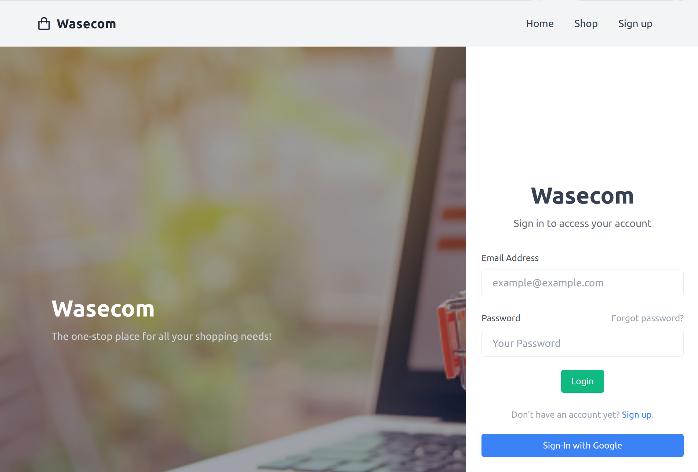
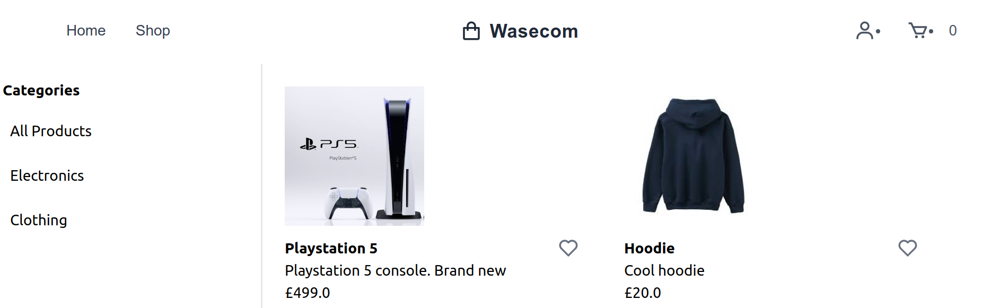
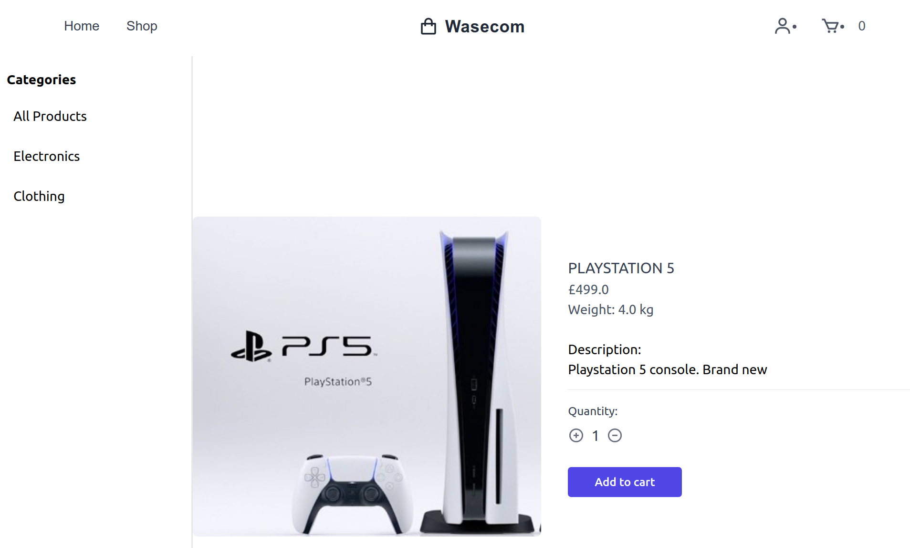
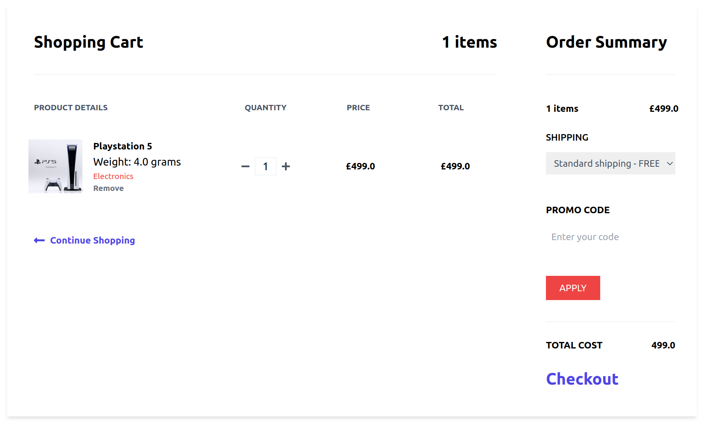
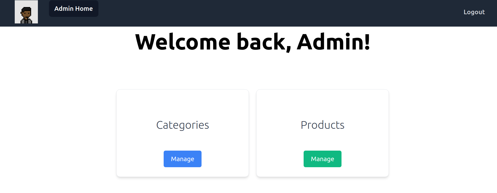
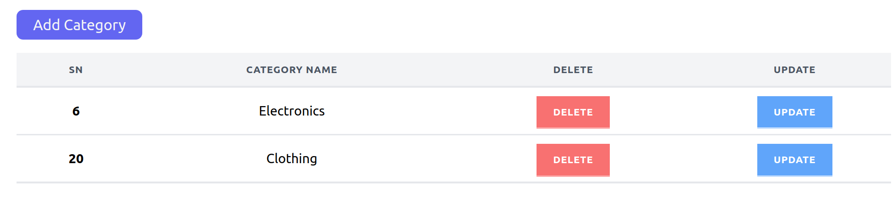
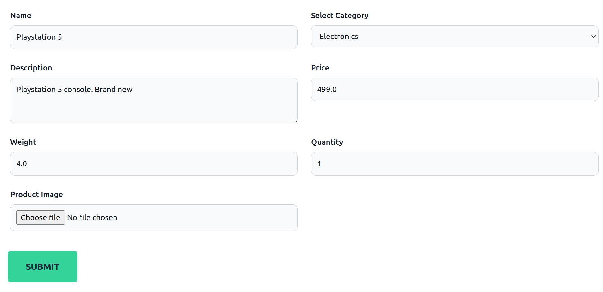

<div id="top"></div>

<!-- PROJECT LOGO -->
<br />
<div align="center">
<h3 align="center">Wasecom</h3>

  <p align="center">
    By Wasim Ramzan
  </p>
</div>


<!-- TABLE OF CONTENTS -->
<details>
  <summary>Table of Contents</summary>
  <ol>
    <li>
      <a href="#project-description">Project Description</a>
    <li>
      <a href="#getting-started">Getting Started</a>
      <ul>
        <li><a href="#installation">Installation</a></li>
      </ul>
    </li>
    <li><a href="#application-images">Application Images</a></li>
    <li><a href="#extra-implementations-information">Additional Information</a></li>
    <li><a href="#to-do">To Do</a></li>
    <li><a href="#contact">Contact</a></li>
  </ol>
</details>


<!-- PROJECT DESCRIPTION -->
## Project Description

Wasecom is a simple ecommerce website using Spring Boot, Thymeleaf, Tailwind and more!

<br>

<!-- Technologies Used -->
### Technologies Used

Here are some of the frameworks, libraries and kits used which I made efficient use of whilst creating the website.

* [Spring Boot](https://spring.io/projects/spring-boot)
* [Thymeleaf](https://www.thymeleaf.org/)
* [TailwindCSS](https://tailwindcss.com/)

<p align="right">(<a href="#top">back to top</a>)</p>


<!-- GETTING STARTED -->
## Getting Started

May have to run pom.xml if errors occur.

### Installation

1. Clone the repo
   ```sh
   git clone git@github.com:Wasim27/Wasecom.git
   ```

2. Build Dockerfile and start containers
   ```
   mvn spring-boot:run
   ```
3. Go to the web server \
   http://localhost:8088/

<p align="right">(<a href="#top">back to top</a>)</p>


<!-- Application Images -->
## Application Images
<br>

<div align="center">
  
</div>
<div align="center">
  
</div>
<div align="center">
  
</div>
<div align="center">
  
</div>
<div align="center">
  
</div>
<div align="center">
  
</div>
<div align="center">
  
</div>

<br>
<br>
<br>


<!-- Extra Implementations Information -->
## Extra Implementations Information
* May have to navigate to /admin when logged in as administrator

  Default user details:
  ```
  Email: admin@gmail.com
  Password: admin
  
  Email: bob@gmail.com
  Password: bob
  ```
<br>

<!-- To-Do -->
## To Do
[] Write some tests (important) \
[] Payment Method \
[] Add to wish list, forgotten password and other features that require implementing \
[] UI Improvements \
[] Bug fixes and suitable error messages on incorrect sign-in etc \
[] Image bug fix have to restart after uploading images (done locally) \
[] Improve categorisation (sub-sub categories)

<p align="right">(<a href="#top">back to top</a>)</p>

<!-- CONTACT -->
## Contact

Name: Wasim Ramzan
<p align="right">(<a href="#top">back to top</a>)</p>

